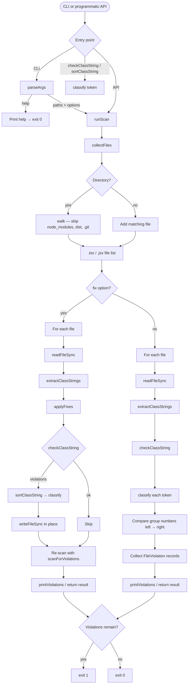

# twaz

Check and automatically fix Tailwind CSS utility class order in JSX/TSX files.

`twaz` enforces a consistent, readable order for `className`, `class`, and `cn()` arguments. It scans source files, reports violations, and can reorder classes in place with `--fix`.

## Table of contents

- [Installation](#installation)
- [Usage](#usage)
  - [CLI](#cli)
  - [Programmatic API](#programmatic-api)
  - [Development](#development)
- [What gets scanned](#what-gets-scanned)
- [Tailwind class order rules](#tailwind-class-order-rules)
  - [Precedence overview](#precedence-overview)
  - [1. Position anchor](#1-position-anchor)
  - [2. Position offsets](#2-position-offsets)
  - [3. Self & group](#3-self--group)
  - [4. Element](#4-element)
  - [5. Margin & padding](#5-margin--padding)
  - [6. Width & height](#6-width--height)
  - [7. Display](#7-display)
  - [8. Text size](#8-text-size)
  - [9. Font](#9-font)
  - [10. Text color](#10-text-color)
  - [11. Background & fill color](#11-background--fill-color)
  - [12. Variant modifiers](#12-variant-modifiers)
  - [13. Transition](#13-transition)
  - [14. Border](#14-border)
  - [15. Rounding](#15-rounding)
  - [16. Shadow](#16-shadow)
  - [17. Truncate & overflow](#17-truncate--overflow)
  - [18. Children (grid & flex)](#18-children-grid--flex)
  - [19. End](#19-end)
- [Examples](#examples)
- [How violations are detected](#how-violations-are-detected)
- [Execution flow](#execution-flow)
- [In conclusion](#in-conclusion)

## Installation

```bash
npm install -D twaz
```

Or run without installing:

```bash
npx twaz src
```

## Usage

### CLI

```bash
# Check class order (default: current directory)
twaz

# Check a specific directory or file
twaz src
twaz src/components/Button.tsx

# Automatically fix class order in place
twaz --fix src
```

### Programmatic API

```ts
import { checkClassString, sortClassString, runScan } from "twaz";

checkClassString("bg-muted text-sm absolute");
// → [{ token: "bg-muted", group: "background & fill color", after: "text size" }, ...]

sortClassString("bg-muted text-sm absolute top-0");
// → "absolute top-0 text-sm bg-muted"

const { violations } = runScan(["src"], { fix: false });
```

### Development

```bash
npm install
npm run dev          # run CLI with tsx (debug)
npm run fix          # run CLI with --fix via tsx
npm run typecheck    # TypeScript check
npm run build        # production build with tsdown
```

## What gets scanned

By default, `twaz` scans `.tsx` and `.jsx` files. It looks for class strings in:

- `className="..."` / `className='...'`
- `className={`...`}` / `className={"..."}`
- `class="..."`
- `cn("...")` / `classNames("...")`

Directories `node_modules`, `dist`, and `.git` are skipped.

---

## Tailwind class order rules

When writing or editing `className`, `class`, or `cn()` arguments, order utility classes in this sequence. Separate groups with a single space. Keep variant prefixes attached to each utility (e.g. `hover:bg-primary`, not `hover: bg-primary`).

### Precedence overview

Lower numbers sort earlier (left). Higher numbers sort later (right).

| # | Group | Examples |
|---|-------|----------|
| 1 | Position anchor | `relative`, `absolute`, `fixed`, `sticky`, `static` |
| 2 | Position offsets | `inset-*`, `top-*`, `right-*`, `bottom-*`, `left-*` |
| 3 | Self & group | `self-*`, `group`, `group/name` |
| 4 | Element | `shrink-*`, `grow-*`, `select-*`, `whitespace-*`, `compress-zero` |
| 5 | Margin & padding | `m-*`, `p-*`, and axis variants |
| 6 | Width & height | `w-*`, `h-*`, `min-*`, `max-*`, `size-*`, `aspect-*` |
| 7 | Display | `block`, `inline`, `hidden`, `visible` |
| 8 | Text size | `text-xs`, `text-sm`, `text-base`, `text-lg`, etc. |
| 9 | Font | `font-*` (e.g. `font-medium`, `font-mono`) |
| 10 | Text color | `text-red-500`, `text-muted-foreground`, `text-center` |
| 11 | Background & fill color | `bg-*`, `fill-*`, `stroke-*`, gradients, `opacity-*` |
| 12 | Variant modifiers | `hover:`, `focus:`, `disabled:`, `aria-*:`, `data-*:`, `dark:`, `md:` |
| 13 | Transition | `transition-*`, `duration-*`, `animate-*` |
| 14 | Border | `border`, `border-*`, `outline-*`, `ring-*`, `divide-*` |
| 15 | Rounding | `rounded-*` |
| 16 | Shadow | `shadow-*` |
| 17 | Truncate & overflow | `truncate`, `overflow-*`, `text-ellipsis` |
| 18 | Children (grid & flex) | `grid-*`, `flex`, `gap-*`, `items-*`, `justify-*`, etc. |
| 19 | End | `cursor-*`, `pointer-events-*`, `z-*` (always last) |

Within the same group, the original relative order is preserved (stable sort).

---

### 1. Position anchor

Positioning mode comes first — before any offset values.

```
relative | absolute | fixed | sticky | static
```

Variant-prefixed anchors (e.g. `md:absolute`) are treated as **variant modifiers** (group 12) and sort after base color utilities.

### 2. Position offsets

Offset utilities immediately follow the position anchor.

```
inset-* | top-* | right-* | bottom-* | left-*
```

### 3. Self & group

Self-alignment and group markers for child state styling.

```
self-* | group | group/accordion-trigger
```

Named groups like `group/accordion-trigger` are recognized as group utilities, not variant prefixes.

### 4. Element

Intrinsic element behavior — flex item sizing, text selection, whitespace.

```
shrink-* | grow-* | basis-* | select-* | whitespace-* | compress-zero
```

### 5. Margin & padding

Spacing around the element. **Unprefixed only** — responsive or state-prefixed spacing (e.g. `md:px-4`, `hover:p-2`) is treated as a **variant modifier** (group 12).

```
m-* | mx-* | my-* | mt-* | mr-* | mb-* | ml-*
p-* | px-* | py-* | pt-* | pr-* | pb-* | pl-*
```

### 6. Width & height

Box dimensions.

```
w-* | h-* | min-w-* | max-w-* | min-h-* | max-h-* | size-* | aspect-*
```

### 7. Display

Display mode utilities.

```
block | inline | hidden | visible | isolate
```

Variant-prefixed display utilities (e.g. `md:hidden`) sort as **variant modifiers**.

### 8. Text size

Font size tokens only — not color or alignment.

```
text-xs | text-sm | text-base | text-lg | text-xl | text-2xl … text-9xl
```

### 9. Font

Font family, weight, and related typography — after text size, before color.

```
font-medium | font-mono | font-condensed | font-*
```

### 10. Text color

Text color and text-related non-size utilities. **Unprefixed only.**

```
text-red-500 | text-muted-foreground | text-background | text-center | text-left
```

Anything matching `text-*` that is **not** a text size token (group 8) belongs here.

### 11. Background & fill color

Surface and decorative color. **Unprefixed only.**

```
bg-* | fill-* | stroke-* | from-* | to-* | via-* | opacity-*
accent-* | caret-* | decoration-*
```

### 12. Variant modifiers

Any utility with a variant prefix that was not already placed in an earlier group. This includes responsive, state, dark mode, ARIA, and data attribute variants.

```
hover:* | focus:* | disabled:* | aria-*:* | data-*:* | dark:* | md:* | lg:*
group-hover:* | group-data-*:* | hidden:*
```

**Rules:**

- Prefixed margin/padding, display, position, border, rounding, shadow, and children utilities land here.
- Variant-prefixed transition utilities also land here (base `transition-*` without a prefix is group 13).
- The `:` prefix stays attached to the utility name.

### 13. Transition

Motion and animation for the element itself (unprefixed).

```
transition-* | duration-* | animate-*
```

Placed after color-defining classes so base colors are established before motion.

### 14. Border

Borders, outlines, rings, and dividers. `rounded-*` is excluded (see group 15).

```
border | border-* | outline-* | ring-* | divide-*
```

### 15. Rounding

Corner radius.

```
rounded-* | rounded-sm | rounded-md | rounded-full
```

### 16. Shadow

Box shadows.

```
shadow-* | shadow-sm | shadow-md | shadow-lg
```

### 17. Truncate & overflow

Text truncation and overflow — **before** children layout utilities.

```
truncate | overflow-* | text-ellipsis
```

### 18. Children (grid & flex)

Layout that affects children. Within this group, `grid-*` sorts before `flex` utilities when both are present.

```
grid | grid-* | inline-grid
flex | inline-flex | flex-*
gap-* | items-* | justify-* | content-* | place-*
order-* | col-* | row-* | space-x-* | space-y-* | list-*
```

Variant-prefixed children utilities (e.g. `md:flex`) sort as **variant modifiers**.

### 19. End

Interaction and stacking — **always last**.

```
cursor-* | pointer-events-* | z-*
```

---

## Examples

### Position before offsets; text color before background

```tsx
// ❌ BAD
<div className="top-0 left-0 absolute bg-muted text-sm text-muted-foreground" />

// ✅ GOOD
<div className="absolute top-0 left-0 text-sm text-muted-foreground bg-muted" />
```

### Font after text size; hover after base color

```tsx
// ❌ BAD
<button className="font-medium text-sm hover:bg-primary flex px-4 h-9 bg-background border rounded-md" />

// ✅ GOOD
<button className="px-4 h-9 text-sm font-medium text-foreground bg-background hover:bg-primary border rounded-md flex" />
```

### Group near position; z-index last

```tsx
// ❌ BAD
<div className="px-3 py-2 group/accordion-trigger relative z-50 flex cursor-pointer" />

// ✅ GOOD
<div className="relative group/accordion-trigger px-3 py-2 text-sm font-medium text-muted-foreground bg-muted flex cursor-pointer z-50" />
```

### Overflow before flex children

```tsx
// ❌ BAD
<div className="flex gap-2 overflow-auto truncate w-full" />

// ✅ GOOD
<div className="w-full overflow-auto truncate flex gap-2" />
```

---

## How violations are detected

`twaz` walks each class string left to right. Each token is classified into a group number. If a token's group number is **lower** than a token that appeared earlier, it is reported as a violation — it should have appeared earlier in the string.

Unrecognized tokens are ignored for ordering (they do not trigger violations and stay in place during `--fix`).

---

## Execution flow



## In conclusion

twaz is an acronym standing for "Tailwind from A to Z" (referring not to alphabetical order, but to the order of values ​​in the CSS layout model).

Happy coding!
